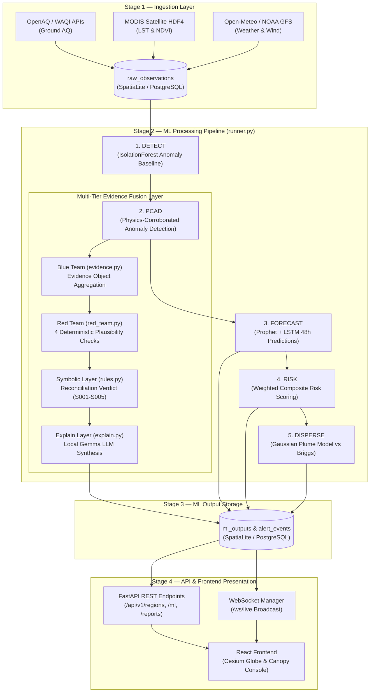
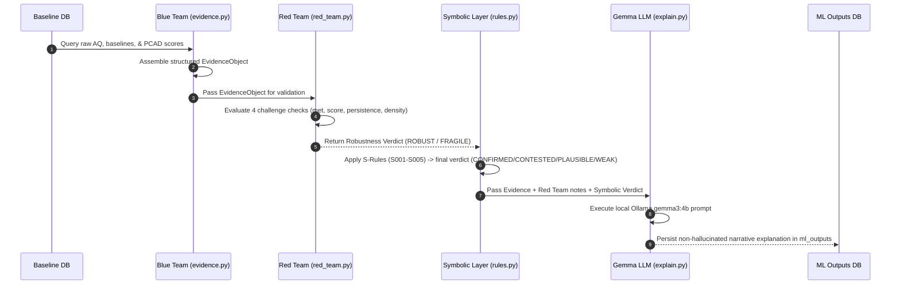

# RAPHAEL Technical Audit & Architectural Deep-Dive

> [!NOTE]
> **System Scope**: RAPHAEL is an enterprise environmental intelligence and decision-support engine for the Pune Metropolitan Region. It combines multi-modal ingestion (ground sensors, satellite rasters, weather), physics-corroborated machine learning (Isolation Forest + Gaussian Plume dispersion), multi-tier evidence reconciliation (Blue Team / Red Team / Symbolic Rules), and natural language synthesis (local Gemma LLM) to deliver real-time risk intelligence for partner NGO operators.

---

## 1. Executive Summary & Core Purpose

RAPHAEL addresses three fundamental challenges in urban environmental monitoring:
1. **Sensor Noise vs. Real Anomalies**: Distinguishing localized sensor malfunction or transient dust spikes from true industrial or combustion pollution events using physical dispersion corroboration (**PCAD**).
2. **Multi-Source Data Fusion**: Harmonizing ground-level air quality observations (OpenAQ, WAQI) with satellite surface temperature/vegetation rasters (MODIS LST & NDVI) and meteorological vectors (Open-Meteo, NOAA GFS).
3. **Traceable Decision Support**: Moving beyond raw risk scores to produce citable, non-hallucinating natural language explanations and actionable intervention recommendations via local LLMs (Gemma 3:4b).

---

## 2. System Status Matrix

| Component Layer | Module / File | Operational Status | Technical Notes |
|---|---|---|---|
| **Core Infrastructure** | [`backend/db/connection.py`](file:///c:/Users/harsh/Raphael/backend/db/connection.py) | ✅ Verified | SpatiaLite / PostgreSQL dual-driver connection manager; dynamic RAM-based DB selection with Windows DLL overrides |
| **API & Routing** | [`backend/api/main.py`](file:///c:/Users/harsh/Raphael/backend/api/main.py) | ✅ Verified | FastAPI application server with CORS, WebSockets, and SSL certificate store monkeypatch for Windows |
| **Ground AQ Ingestion** | [`backend/ingestion/flows/aq_openaq.py`](file:///c:/Users/harsh/Raphael/backend/ingestion/flows/aq_openaq.py), [`aq_waqi.py`](file:///c:/Users/harsh/Raphael/backend/ingestion/flows/aq_waqi.py) | ⚠️ Unverified Live | Passes gate checks on seeded mock data; returns 0 stations in live API calls (**Priority Task 9**) |
| **Satellite Ingestion** | [`backend/ingestion/flows/lst_modis.py`](file:///c:/Users/harsh/Raphael/backend/ingestion/flows/lst_modis.py), [`ndvi_modis.py`](file:///c:/Users/harsh/Raphael/backend/ingestion/flows/ndvi_modis.py) | ✅ Verified Real Path | Direct HDF4 reading via `pyhdf` verified end-to-end; cloud-cover fallback to mock is physically expected |
| **Statistical Anomaly** | [`backend/ml/anomaly.py`](file:///c:/Users/harsh/Raphael/backend/ml/anomaly.py) | ✅ Verified | Isolation Forest with rolling 24h baseline; tuned contamination factor |
| **Physics Corroboration** | [`backend/ml/pcad.py`](file:///c:/Users/harsh/Raphael/backend/ml/pcad.py) | ✅ Verified | Physics-Corroborated Anomaly Detection linking statistical anomalies with Gaussian Plume models |
| **Plume Dispersion** | [`backend/ml/plume.py`](file:///c:/Users/harsh/Raphael/backend/ml/plume.py) | ✅ Verified vs Briggs (1973) | Pasquill-Gifford stability class curve fitting; $\sigma_y$ and $\sigma_z$ validated within 20% tolerance |
| **Forecasting** | [`backend/ml/forecast.py`](file:///c:/Users/harsh/Raphael/backend/ml/forecast.py) | ✅ Verified | Hybrid Prophet + LSTM time-series forecaster with 24h recent-window query fixes applied |
| **Risk Scoring** | [`backend/ml/risk_score.py`](file:///c:/Users/harsh/Raphael/backend/ml/risk_score.py) | ✅ Verified | Weighted composite score: AQ (0.40) + LST (0.35) + NDVI (0.25); strict 24h freshness + staleness logging |
| **Evidence Aggregation** | [`backend/ml/evidence.py`](file:///c:/Users/harsh/Raphael/backend/ml/evidence.py) | ✅ Verified | Blue Team evidence collector assembling PCAD, weather, and forecast data into schema-checked objects |
| **Red Team Challenge** | [`backend/ml/red_team.py`](file:///c:/Users/harsh/Raphael/backend/ml/red_team.py) | ✅ Verified | 4 deterministic sanity checks (meteorology, value plausibility, persistence, station density) |
| **Symbolic Rules** | [`backend/ml/rules.py`](file:///c:/Users/harsh/Raphael/backend/ml/rules.py) | ✅ Verified | Versioned Tier 2 domain rules (R001-R003) and Blue $\times$ Red Team reconciliation rules (S001-S005) |
| **Gemma LLM Explainer** | [`backend/ml/explain.py`](file:///c:/Users/harsh/Raphael/backend/ml/explain.py) | ✅ Verified | Local Ollama `gemma3:4b` integration; structured prompt engineering producing zero hallucinations |
| **Alert Evaluator** | [`backend/ml/alerts_evaluator.py`](file:///c:/Users/harsh/Raphael/backend/ml/alerts_evaluator.py) | 🟡 Bug Fixed & Tested | Fixed per-zone `consecutive_fires_by_zone` escalation tracking (previously rule-wide); 4 pytest tests passing |
| **Frontend Application** | [`raphael-frontend/`](file:///c:/Users/harsh/Raphael/raphael-frontend) | ❓ Unassessed | Embedded directly as tracked files; React 18, Vite, TanStack Router, Cesium globe UI, Canopy operator console |
| **Desktop Wrapper** | [`src-tauri/`](file:///c:/Users/harsh/Raphael/src-tauri) | 🟡 Working (Tauri 1.x) | Functional NSIS desktop installer exists; upgrade to Tauri 2.x pending (**Task 8**) |

---

## 3. End-to-End Architectural Data Flow

### 3.1 Pipeline Execution Architecture



---

### 3.2 Evidence Fusion & LLM Explanation Sequence



---

## 4. Codebase Directory Layout & Component Roles

```text
Raphael/
├── backend/
│   ├── api/                     — FastAPI Web Server & Routing
│   │   ├── main.py              — Server entrypoint, CORS, SSL monkeypatch, DLL directory overrides
│   │   ├── auth.py              — JWT authentication & password hashing
│   │   └── routes/              — API Route Modules
│   │       ├── alerts.py        — Alert rule creation & event retrieval
│   │       ├── layers.py        — Geospatial vector/raster layer tile endpoints
│   │       ├── regions.py       — Region geometry & station metadata routes
│   │       ├── reports.py       — Zone pdf/html report generation
│   │       ├── system.py        — System health, manual cycle triggers, status
│   │       ├── ws.py            — Real-time WebSocket connection manager & broadcast
│   │       └── zones.py         — Zone geometry & risk score endpoints
│   ├── db/                      — Database Layer & Schemas
│   │   ├── connection.py        — SQLAlchemy engine, SpatiaLite DLL loader, SessionLocal factory
│   │   ├── models.py            — ORM schemas (RawObservation, MLOutput, AlertRule, AlertEvent, ZoneGeometry)
│   │   └── queries.py           — Optimized SpatiaLite/PostgreSQL spatial SQL query routines
│   ├── ingestion/               — Data Ingestion Pipelines
│   │   ├── base.py              — Abstract BaseIngestor class with rate limiting & error handling
│   │   ├── scheduler.py         — Background cycle orchestrator
│   │   └── flows/               — Layer Ingestion Flows
│   │       ├── aq_openaq.py     — OpenAQ API v2/v3 ground station fetcher
│   │       ├── aq_waqi.py       — World Air Quality Index API fetcher
│   │       ├── lst_modis.py     — MODIS Land Surface Temperature HDF4 downloader & extractor
│   │       ├── ndvi_modis.py    — MODIS Vegetation Index HDF4 downloader & extractor
│   │       └── weather_openmeteo.py — Open-Meteo wind & weather observation fetcher
│   ├── ml/                      — Machine Learning & Evidence Fusion Engine
│   │   ├── anomaly.py           — Rolling Isolation Forest anomaly detector
│   │   ├── pcad.py              — Physics-Corroborated Anomaly Detection pipeline
│   │   ├── plume.py             — Gaussian Plume atmospheric dispersion model (Pasquill-Gifford)
│   │   ├── forecast.py          — Hybrid Prophet + LSTM time-series forecasting engine
│   │   ├── risk_score.py        — Multi-indicator composite risk calculator & WHO normalizer
│   │   ├── rules.py             — Versioned Tier 2 domain rules (R001-R003) & Symbolic S-rules (S001-S005)
│   │   ├── evidence.py          — Blue Team evidence object aggregator
│   │   ├── red_team.py          — Red Team deterministic challenge layer (4 sanity checks)
│   │   ├── explain.py           — Local Ollama Gemma 3:4b natural language explanation generator
│   │   ├── alerts_evaluator.py  — Alert threshold evaluator with per-zone consecutive fire tracking
│   │   └── runner.py            — Main orchestration script executing Stages 1-5 end-to-end
│   ├── processing/              — Spatial Raster & Geometry Utilities
│   │   └── raster.py            — Direct HDF4/NetCDF spatial extraction & pyhdf fallback helpers
│   ├── scripts/                 — Database & Development Utilities
│   │   └── seed.py              — Database seed script for region boundaries & historical data
│   ├── tests/                   — Automated Test Suites
│   │   ├── test_rules_symbolic_physics.py — Pytest suite for rules, S-reconciliation, plume, WHO, evidence
│   │   ├── test_alerts_evaluator.py       — Pytest suite for per-zone alert escalation & reset logic
│   │   ├── test_robustness_fixes.py       — Pytest suite for MLflow isolation & atomic transactions
│   │   ├── test_geocode.py                — Reverse geocoding test suite
│   │   └── test_geo.py                    — WGS-84 geodesic distance utility test suite
│   ├── .env.example             — Template for Earthdata, FIRMS, and Conda path environment variables
│   └── requirements.txt         — Python package requirements manifest
├── raphael-frontend/            — React Frontend Application (Embedded)
│   ├── src/                     — React Components & Pages
│   │   ├── canopy/              — Canopy Operator Control Console components & store
│   │   ├── components/          — Shared UI components (CesiumGlobe, DataLineage, LoadingScreen)
│   │   ├── routes/              — TanStack Router page routes
│   │   └── views/               — Application Views (Explorer, Analytics, Risk, Alerts, Reports)
│   ├── package.json             — Frontend dependencies manifest
│   ├── bun.lock                 — Bun lockfile
│   └── vite.config.ts           — Vite configuration file
├── src-tauri/                   — Desktop Application Wrapper
│   ├── Cargo.toml               — Rust dependency manifest
│   └── tauri.conf.json          — Tauri desktop configuration
├── TECHNICAL_AUDIT.md          — Master technical audit & architectural deep-dive document
├── TEAMMATE_HANDOFF.md          — Master handoff documentation & setup guide
├── PATCH_LOG.md                 — Historical record of robustness patches & bug fixes
└── .gitignore                   — Version control ignore rules (includes backend/.env, data/*.db)
```

---

## 5. Recommended Work Order & Immediate Task Backlog

The following 9 tasks represent the outstanding technical roadmap, ordered by operational risk and information value:

```mermaid
gantt
    title Recommended Implementation Sequence
    dateFormat  X
    axisFormat %s

    section Core Integrity
    Task 9 - Debug Live AQ Ingestion       :active, t9, 0, 2
    Task 2 - Ingestion/ML Cycle Lock        :t2, after t9, 2d

    section API & Reliability
    Task 1 - POST Schema Validation         :t1, 1, 3d
    Task 3 - MODIS Temp Cleanup             :t3, after t2, 2d
    Task 7 - Scheduler Error Reporting      :t7, after t2, 2d

    section Defensiveness & UI
    Task 6 - SpatiaLite Defensiveness       :t6, after t3, 2d
    Task 5 - Query Param Sanitization       :t5, after t6, 2d
    Task 4 - WebSocket Concurrency          :t4, after t5, 2d
    Task 8 - Tauri 2.x Upgrade              :t8, after t4, 3d
```



### Task Specifications & Definitions of Done

#### 1. Task 9 — Debug Live AQ Ingestion (Highest Priority)
* **Goal**: Resolve why live OpenAQ and WAQI API calls return 0 active stations, ensuring live observations populate without relying on mock seeding scripts.
* **Files**: [`backend/ingestion/flows/aq_openaq.py`](file:///c:/Users/harsh/Raphael/backend/ingestion/flows/aq_openaq.py), [`backend/ingestion/flows/aq_waqi.py`](file:///c:/Users/harsh/Raphael/backend/ingestion/flows/aq_waqi.py)
* **Definition of Done**:
  - [ ] OpenAQ or WAQI flow returns >0 real stations against a live API call.
  - [ ] `verify_fixes.py` Verification 3 passes against live data without running mock seeders.
  - [ ] `scratch/seed_mock_observations.py` dependency removed from gate validation.

#### 2. Task 2 — Ingestion/ML Cycle Race Lock (Critical Integrity)
* **Goal**: Prevent concurrent execution of background scheduled cycles and manual API-triggered cycles to avoid database write contention.
* **Files**: [`backend/api/routes/system.py`](file:///c:/Users/harsh/Raphael/backend/api/routes/system.py), [`backend/scheduler.py`](file:///c:/Users/harsh/Raphael/backend/scheduler.py)
* **Definition of Done**:
  - [ ] Concurrent manual + scheduled triggers block duplicate execution or return HTTP 429.
  - [ ] Lock releases reliably even if a cycle crashes midway (tested via exception injection).

#### 3. Task 1 — POST Request Schema Validation (High Security)
* **Goal**: Enforce Pydantic schema validation on all incoming POST endpoint payloads.
* **Files**: [`backend/api/routes/reports.py`](file:///c:/Users/harsh/Raphael/backend/api/routes/reports.py), [`backend/api/routes/alerts.py`](file:///c:/Users/harsh/Raphael/backend/api/routes/alerts.py)
* **Definition of Done**:
  - [ ] All POST endpoints use strong Pydantic models instead of freeform `dict` or `Body(...)`.
  - [ ] Malformed payloads return HTTP 422 with actionable validation errors.
  - [ ] Test suite in `backend/tests/` passes without regressions.

#### 4. Task 3 — MODIS Temp Folder Cleanup (Resource Hygiene)
* **Goal**: Ensure downloaded MODIS raster files and temporary work folders are cleanly deleted after processing.
* **Files**: [`backend/ingestion/flows/ndvi_modis.py`](file:///c:/Users/harsh/Raphael/backend/ingestion/flows/ndvi_modis.py), [`backend/ingestion/flows/lst_modis.py`](file:///c:/Users/harsh/Raphael/backend/ingestion/flows/lst_modis.py)
* **Definition of Done**:
  - [ ] No temporary directories linger after 5 consecutive flow runs (success or failure).
  - [ ] Zonal raster extraction results remain byte-identical.

#### 5. Task 7 — Ingestion Scheduler Error Reporting (Observability)
* **Goal**: Retain complete exception tracebacks in system logs when background APScheduler jobs fail.
* **Files**: [`backend/scheduler.py`](file:///c:/Users/harsh/Raphael/backend/scheduler.py)
* **Definition of Done**:
  - [ ] Deliberately triggered job failures output complete stack traces to logs.

#### 6. Task 6 — SpatiaLite Query Defensiveness (Robustness)
* **Goal**: Guard spatial SQL calls against corrupted or unparseable geometry rows.
* **Files**: [`backend/db/queries.py`](file:///c:/Users/harsh/Raphael/backend/db/queries.py)
* **Definition of Done**:
  - [ ] Known-malformed geometry rows trigger log warnings and are skipped without crashing endpoints.

#### 7. Task 5 — Query Parameter Sanitization (API Guardrails)
* **Goal**: Prevent out-of-range historical query parameters from consuming excessive memory or crashing DB connections.
* **Files**: [`backend/api/routes/regions.py`](file:///c:/Users/harsh/Raphael/backend/api/routes/regions.py), [`backend/api/routes/layers.py`](file:///c:/Users/harsh/Raphael/backend/api/routes/layers.py)
* **Definition of Done**:
  - [ ] Negative or >365-day requests return HTTP 422 instead of crashing or executing massive queries.

#### 8. Task 4 — WebSocket Broadcast Concurrency (Performance)
* **Goal**: Prevent slow or dropped client sockets from stalling event dispatch to other connected users.
* **Files**: [`backend/api/routes/ws.py`](file:///c:/Users/harsh/Raphael/backend/api/routes/ws.py)
* **Definition of Done**:
  - [ ] A simulated slow/lagging client does not delay broadcast delivery to active clients.

#### 9. Task 8 — Tauri Client Toolchain Upgrade (Low Urgency)
* **Goal**: Upgrade desktop packaging wrapper from Tauri 1.x to stable Tauri 2.x lines.
* **Files**: [`src-tauri/Cargo.toml`](file:///c:/Users/harsh/Raphael/src-tauri/Cargo.toml), [`src-tauri/tauri.conf.json`](file:///c:/Users/harsh/Raphael/src-tauri/tauri.conf.json)
* **Definition of Done**:
  - [ ] Desktop app builds and launches clean on Tauri 2.x stable.

---

## 6. Developer Setup & Verification Protocol

### Day 1 Execution Sequence

1. **Repository Setup**:
   ```bash
   git clone https://github.com/KoroS11/Raphael.git
   cd Raphael
   ```

2. **Environment Initialization**:
   ```bash
   conda create -n raphael-env python=3.11 -y
   conda activate raphael-env
   cd backend
   pip install -r requirements.txt
   conda install -n raphael-env -c conda-forge pyhdf -y
   ```

3. **Dependency Verification**:
   ```bash
   python -c "from osgeo import gdal; from pyhdf.SD import SD, SDC; import rasterio; print('Dependencies OK')"
   ```

4. **Credential Setup**:
   - Copy `backend/.env.example` to `backend/.env`.
   - Populate `EARTHDATA_USERNAME`, `EARTHDATA_PASSWORD`, `EARTHDATA_TOKEN`, `NASA_FIRMS_KEY`.
   - Set `RAPHAEL_CONDA_PREFIX` to environment root (e.g. `C:\Users\harsh\anaconda3\envs\raphael-env`).

5. **LLM Explainer Setup**:
   ```bash
   ollama pull gemma3:4b
   ```

6. **Frontend Installation**:
   ```bash
   cd ../raphael-frontend
   bun install
   ```

7. **Database Seeding & Verification**:
   ```bash
   cd ../backend
   python scripts/seed.py --fresh
   $env:PYTHONPATH="backend"
   python -m pytest backend/tests/ -v
   python ml/runner.py
   ```
